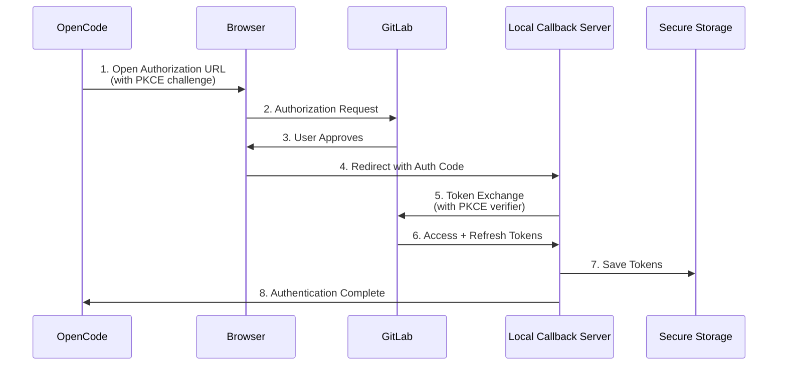
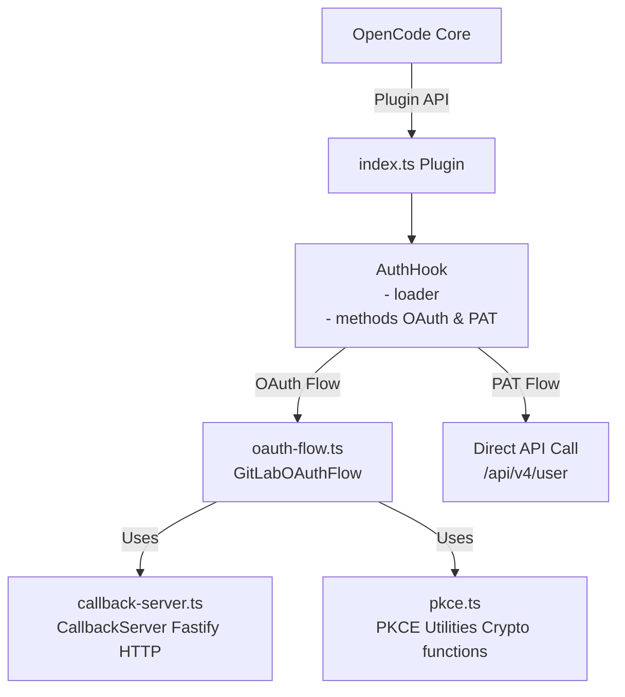
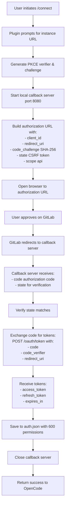
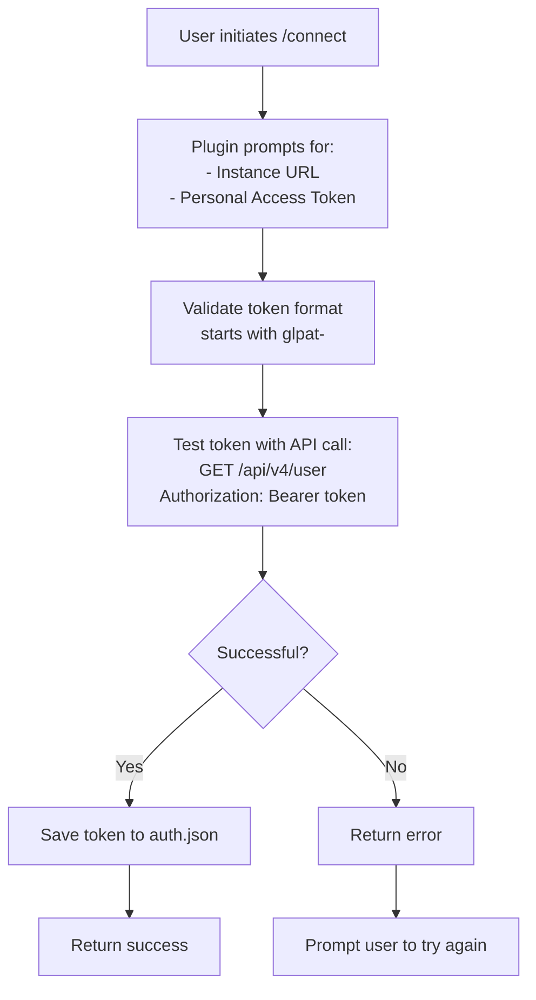
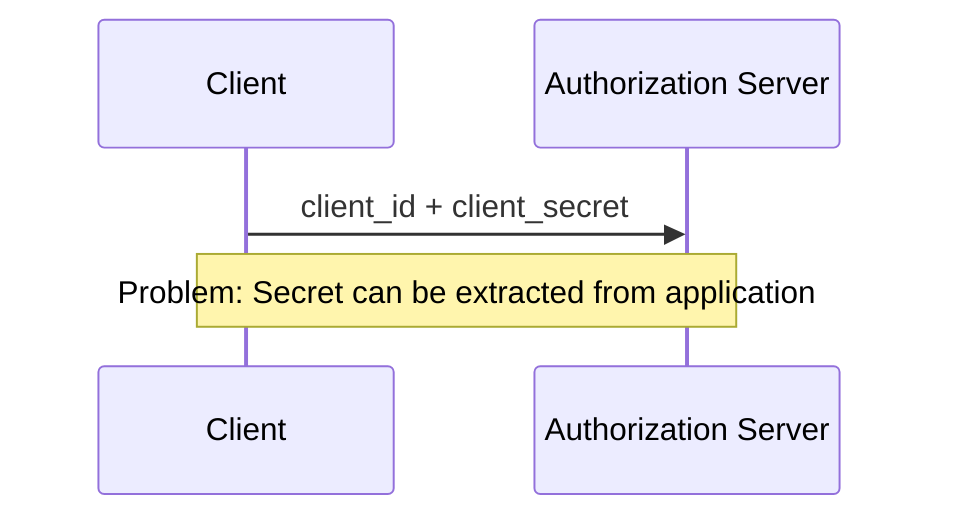
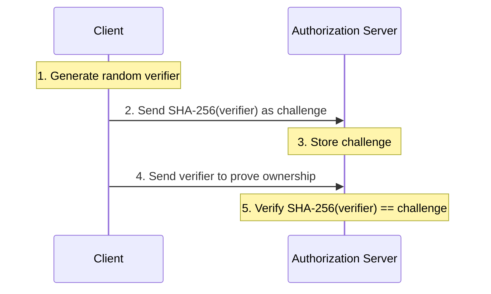
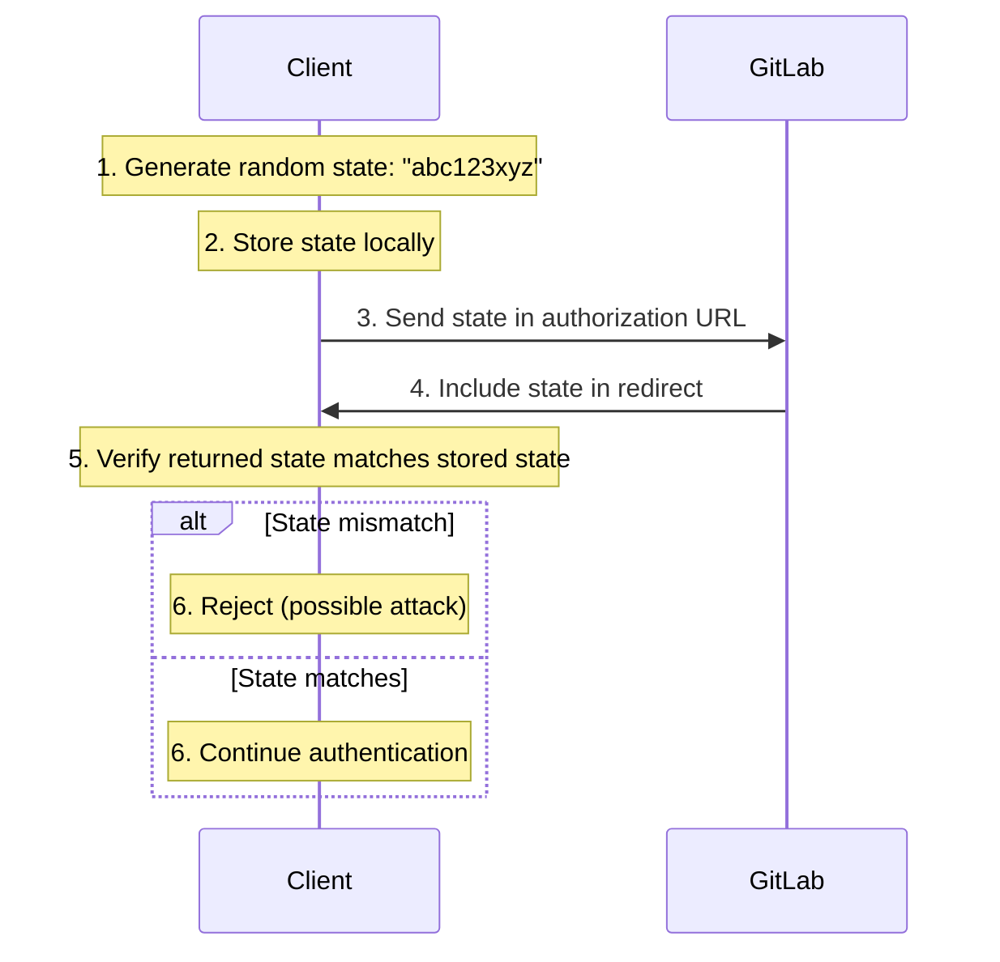

# OpenCode GitLab Auth

A secure OAuth 2.0 and Personal Access Token authentication plugin for [OpenCode](https://opencode.ai) that enables seamless integration with GitLab.com and self-hosted GitLab instances.

[](https://www.npmjs.com/package/@gitlab/opencode-gitlab-auth)
[](https://opensource.org/licenses/MIT)

## Features

### 🔐 Dual Authentication Methods

- **OAuth 2.0 Flow** - Secure browser-based authentication with automatic token management
- **Personal Access Token (PAT)** - Simple token-based authentication for automation and CI/CD

### 🛡️ Security First

- **PKCE (Proof Key for Code Exchange)** - Enhanced OAuth security without client secrets
- **State Parameter** - CSRF attack prevention
- **Secure Token Storage** - Credentials stored with 600 file permissions
- **Automatic Token Refresh** - Seamless token renewal via OpenCode's auth system
- **Rate Limiting** - Built-in protection against abuse (30 requests/minute)

### 🌐 Flexible Instance Support

- GitLab.com (default)
- Self-hosted GitLab instances
- Custom instance URL configuration

### 🚀 Developer Experience

- Automatic browser opening for OAuth
- Local callback server for seamless authorization
- No manual code copying required
- Comprehensive error handling and user feedback
- Debug logging for troubleshooting

## Table of Contents

- [Installation](#installation)
- [Quick Start](#quick-start)
- [Authentication Methods](#authentication-methods)
  - [OAuth 2.0 (Recommended)](#oauth-20-recommended)
  - [Personal Access Token](#personal-access-token)
- [Configuration](#configuration)
- [Architecture](#architecture)
- [API Reference](#api-reference)
- [Security](#security)
- [Troubleshooting](#troubleshooting)
- [Development](#development)
- [Contributing](#contributing)
- [License](#license)

## Installation

### Prerequisites

- Node.js 18.0.0 or higher
- npm 9.0.0 or higher
- OpenCode installed and configured

### Install via npm

```bash
npm install @gitlab/opencode-gitlab-auth
```

### Install via npm link (Development)

```bash
# Clone the repository
git clone https://gitlab.com/gitlab-org/editor-extensions/opencode-gitlab-auth.git
cd opencode-gitlab-auth

# Install dependencies
npm install

# Build the project
npm run build

# Link globally
npm link

# In your OpenCode installation, link the plugin
npm link @gitlab/opencode-gitlab-auth
```

## Quick Start

### 1. Configure OpenCode

Add the plugin to your OpenCode configuration:

```json
{
  "plugins": ["@gitlab/opencode-gitlab-auth"]
}
```

### 2. Set Up OAuth (Optional but Recommended)

For OAuth authentication, you need to register an OAuth application on GitLab:

1. Go to [GitLab User Settings > Applications](https://gitlab.com/-/user_settings/applications)
2. Create a new application with:
   - **Name**: `OpenCode GitLab Auth`
   - **Redirect URI**: `http://127.0.0.1:8080/callback`
   - **Confidential**: ✅ (checked)
   - **Scopes**: `api`
3. Copy the **Application ID** (NOT the secret - PKCE doesn't need it)
4. Set the environment variable:

```bash
export GITLAB_OAUTH_CLIENT_ID=your_application_id_here
```

Or create a `.env` file:

```bash
GITLAB_OAUTH_CLIENT_ID=your_application_id_here
```

### 3. Authenticate

Start OpenCode and use the `/connect` command:

```bash
opencode
# In OpenCode:
/connect
```

Choose your authentication method:

- **GitLab OAuth** - Browser-based authentication (recommended)
- **GitLab Personal Access Token** - Token-based authentication

## Authentication Methods

### OAuth 2.0 (Recommended)

OAuth provides the most secure authentication with automatic token refresh and no need to manage long-lived credentials.

#### How It Works

1. **Authorization Request**: OpenCode opens your browser to GitLab's authorization page
2. **User Consent**: You approve the application's access request
3. **Callback Handling**: GitLab redirects to a local callback server
4. **Token Exchange**: The authorization code is exchanged for access and refresh tokens using PKCE
5. **Secure Storage**: Tokens are stored in `~/.local/share/opencode/auth.json` with 600 permissions

#### OAuth Flow Diagram



#### Advantages

- ✅ Most secure method (no long-lived credentials)
- ✅ Automatic token refresh
- ✅ Revocable from GitLab settings
- ✅ No manual token management
- ✅ PKCE eliminates need for client secrets

#### Requirements

- Custom OAuth application registered on GitLab
- `GITLAB_OAUTH_CLIENT_ID` environment variable set
- Browser access for authorization

### Personal Access Token

PAT authentication is simpler but requires manual token management.

#### How to Create a PAT

1. Go to [GitLab User Settings > Access Tokens](https://gitlab.com/-/user_settings/personal_access_tokens)
2. Create a new token with:
   - **Name**: `OpenCode`
   - **Scopes**: `api`
   - **Expiration**: Set according to your security policy
3. Copy the token (starts with `glpat-`)
4. Enter it when prompted by OpenCode

#### Advantages

- ✅ Simple setup (no OAuth app registration)
- ✅ Works in headless environments
- ✅ Suitable for CI/CD pipelines
- ✅ No browser required

#### Disadvantages

- ⚠️ Manual token rotation required
- ⚠️ Long-lived credentials
- ⚠️ No automatic refresh

## Configuration

### Environment Variables

| Variable                 | Description           | Required  | Default              |
| ------------------------ | --------------------- | --------- | -------------------- |
| `GITLAB_OAUTH_CLIENT_ID` | OAuth application ID  | For OAuth | Bundled ID (limited) |
| `XDG_DATA_HOME`          | Custom data directory | No        | `~/.local/share`     |

### Storage Locations

Credentials are stored in platform-specific locations:

- **Linux/macOS**: `~/.local/share/opencode/auth.json`
- **Windows**: `~/.opencode/auth.json`
- **Custom**: `$XDG_DATA_HOME/opencode/auth.json`

File permissions are automatically set to `600` (owner read/write only).

### Debug Logging

Debug logs are written to:

- **Linux/macOS**: `~/.local/share/opencode/log/gitlab-auth.log`
- **Windows**: `~/.opencode/log/gitlab-auth.log`

Logs include:

- Authentication flow steps
- Token exchange details
- Error messages and stack traces
- Timestamps for all events

## Architecture

### Project Structure

```
opencode-gitlab-auth/
├── src/
│   ├── index.ts              # Main plugin entry point
│   ├── oauth-flow.ts         # OAuth 2.0 flow implementation
│   ├── callback-server.ts    # Local HTTP server for OAuth callbacks
│   └── pkce.ts               # PKCE utilities (verifier & challenge)
├── dist/                     # Compiled JavaScript (generated)
├── .husky/                   # Git hooks for code quality
├── package.json
├── tsconfig.json
└── README.md
```

### Core Components

#### 1. Plugin Entry Point (`index.ts`)

The main plugin that integrates with OpenCode's authentication system.

**Key Functions:**

- `gitlabAuthPlugin()` - Main plugin export implementing OpenCode's `Plugin` interface
- `debugLog()` - File-based logging that doesn't interfere with UI
- `getAuthPath()` - Platform-aware auth file path resolution
- `saveAuthData()` - Secure credential storage with proper permissions

**Exports:**

```typescript
export const gitlabAuthPlugin: Plugin;
export default gitlabAuthPlugin;
```

**Authentication Hook:**

```typescript
interface AuthHook {
  provider: 'gitlab';
  loader: (auth: () => Promise<AuthData>) => Promise<LoaderResult>;
  methods: [OAuthMethod, PATMethod];
}
```

#### 2. OAuth Flow (`oauth-flow.ts`)

Implements the complete OAuth 2.0 authorization code flow with PKCE.

**Class: `GitLabOAuthFlow`**

```typescript
class GitLabOAuthFlow {
  constructor(options: OAuthFlowOptions);

  // Start OAuth authorization
  async authorize(): Promise<AuthorizationResult>;

  // Exchange authorization code for tokens
  async exchangeAuthorizationCode(
    code: string,
    codeVerifier: string,
    redirectUri: string
  ): Promise<OAuthTokens>;

  // Refresh access token
  async exchangeRefreshToken(refreshToken: string): Promise<OAuthTokens>;
}
```

**Interfaces:**

```typescript
interface OAuthFlowOptions {
  instanceUrl: string; // GitLab instance URL
  clientId: string; // OAuth client ID
  scopes: string[]; // Requested scopes
  method: 'auto' | 'code'; // Authorization method
  timeout?: number; // Timeout in milliseconds
}

interface OAuthTokens {
  access_token: string;
  refresh_token: string;
  expires_in: number;
  token_type: string;
  scope: string;
  created_at: number;
}

interface AuthorizationResult {
  code: string; // Authorization code
  state: string; // CSRF protection state
  codeVerifier: string; // PKCE verifier
}
```

**Flow Steps:**

1. Generate PKCE parameters (verifier & challenge)
2. Generate random state for CSRF protection
3. Build authorization URL with parameters
4. Open browser or provide manual URL
5. Wait for callback with authorization code
6. Verify state parameter matches
7. Exchange code for tokens using PKCE verifier
8. Return tokens for storage

#### 3. Callback Server (`callback-server.ts`)

Local HTTP server using Fastify to handle OAuth redirects.

**Class: `CallbackServer`**

```typescript
class CallbackServer {
  constructor(options?: CallbackServerOptions);

  // Start the server
  async start(): Promise<void>;

  // Wait for OAuth callback
  async waitForCallback(): Promise<CallbackResult>;

  // Get the actual port being used
  getPort(): number;

  // Get the full callback URL
  getCallbackUrl(): string;

  // Close the server
  async close(): Promise<void>;
}
```

**Interfaces:**

```typescript
interface CallbackServerOptions {
  port?: number; // Port to listen on (0 = random)
  host?: string; // Host to bind to (default: 127.0.0.1)
  timeout?: number; // Timeout in ms (default: 60000)
}

interface CallbackResult {
  code: string; // Authorization code from GitLab
  state: string; // State parameter for verification
}
```

**Features:**

- **Rate Limiting**: 30 requests per 60 seconds
- **Error Handling**: Displays user-friendly error pages
- **Success Page**: Confirms authentication and instructs user
- **Automatic Cleanup**: Closes server after callback or timeout
- **Timeout Protection**: Rejects promise after configured timeout

**Callback Route:**

```
GET /callback?code=xxx&state=yyy
```

Response scenarios:

- ✅ Success: Returns HTML success page, resolves promise
- ❌ Error: Returns HTML error page, rejects promise
- ⏱️ Timeout: Rejects promise after timeout period

#### 4. PKCE Utilities (`pkce.ts`)

Cryptographic functions for OAuth PKCE (Proof Key for Code Exchange).

**Functions:**

```typescript
// Generate cryptographically secure random string
function generateSecret(length: number = 43): string;

// Generate SHA-256 code challenge from verifier
function generateCodeChallengeFromVerifier(verifier: string): string;

// Internal: Base64 URL encoding (RFC 4648 Section 5)
function base64UrlEncode(buffer: Buffer): string;
```

**PKCE Flow:**

1. **Code Verifier**: Random 43-character string

   ```typescript
   const verifier = generateSecret(43);
   // Example: "dBjftJeZ4CVP-mB92K27uhbUJU1p1r_wW1gFWFOEjXk"
   ```

2. **Code Challenge**: SHA-256 hash of verifier

   ```typescript
   const challenge = generateCodeChallengeFromVerifier(verifier);
   // Example: "E9Melhoa2OwvFrEMTJguCHaoeK1t8URWbuGJSstw-cM"
   ```

3. **Authorization**: Send challenge to GitLab
4. **Token Exchange**: Send verifier to prove ownership

**Security:**

- Uses Node.js `crypto` module for secure randomness
- SHA-256 hashing for challenge generation
- Base64 URL encoding (RFC 4648) for safe transmission
- No client secret required

### Component Interactions



### Data Flow

#### OAuth Authentication Flow



#### PAT Authentication Flow



### Security Architecture

#### Token Storage

```
~/.local/share/opencode/auth.json
{
  "gitlab": {
    "type": "oauth",
    "access": "ya29.a0AfH6SMBx...",
    "refresh": "1//0gHZPQhYjIsN...",
    "expires": 1735948800000,
    "enterpriseUrl": "https://gitlab.com"
  }
}
```

**Security Measures:**

- File permissions: `600` (owner read/write only)
- JSON format for easy parsing
- Separate storage per provider
- Includes expiration timestamp
- Enterprise URL for multi-instance support

#### PKCE Security

Traditional OAuth requires a client secret, which can't be securely stored in desktop applications. PKCE solves this:

**Without PKCE (Insecure):**



**With PKCE (Secure):**



**Benefits:**

- No client secret needed
- Verifier never transmitted during authorization
- Challenge can't be reversed to get verifier
- Protects against authorization code interception

#### State Parameter

Prevents CSRF attacks where an attacker tricks a user into authorizing their malicious app:



#### Rate Limiting

Callback server includes rate limiting to prevent abuse:

```typescript
{
  max: 30,              // Maximum requests
  timeWindow: 60000     // Per 60 seconds
}
```

Protects against:

- Brute force attacks
- Denial of service
- Callback flooding

## API Reference

### Plugin Export

```typescript
import gitlabAuthPlugin from '@gitlab/opencode-gitlab-auth';

// Default export
export default gitlabAuthPlugin;

// Named export
export const gitlabAuthPlugin: Plugin;
```

### TypeScript Types

```typescript
// OAuth Flow Options
interface OAuthFlowOptions {
  instanceUrl: string;
  clientId: string;
  scopes: string[];
  method: 'auto' | 'code';
  timeout?: number;
}

// OAuth Tokens Response
interface OAuthTokens {
  access_token: string;
  refresh_token: string;
  expires_in: number;
  token_type: string;
  scope: string;
  created_at: number;
}

// Callback Server Options
interface CallbackServerOptions {
  port?: number;
  host?: string;
  timeout?: number;
}

// Callback Result
interface CallbackResult {
  code: string;
  state: string;
}
```

### OpenCode Integration

The plugin implements OpenCode's `Plugin` interface:

```typescript
interface Plugin {
  auth: AuthHook;
}

interface AuthHook {
  provider: string;
  loader: (auth: () => Promise<AuthData>) => Promise<LoaderResult>;
  methods: AuthMethod[];
}
```

## Security

### Best Practices

1. **Use OAuth over PAT** when possible for better security
2. **Rotate PATs regularly** if using token authentication
3. **Never commit** credentials or tokens to version control
4. **Use environment variables** for OAuth client IDs
5. **Review authorized applications** periodically in GitLab settings
6. **Monitor auth logs** for suspicious activity

### Security Features

| Feature         | Description                 | Benefit                               |
| --------------- | --------------------------- | ------------------------------------- |
| PKCE            | Proof Key for Code Exchange | Eliminates need for client secrets    |
| State Parameter | Random CSRF token           | Prevents cross-site request forgery   |
| Secure Storage  | 600 file permissions        | Protects credentials from other users |
| Token Refresh   | Automatic renewal           | Reduces exposure window               |
| Rate Limiting   | 30 req/min on callback      | Prevents abuse                        |
| HTTPS Only      | Enforced for GitLab API     | Prevents man-in-the-middle attacks    |

### Threat Model

**Protected Against:**

- ✅ Authorization code interception (PKCE)
- ✅ CSRF attacks (state parameter)
- ✅ Token theft from filesystem (600 permissions)
- ✅ Brute force attacks (rate limiting)
- ✅ Man-in-the-middle (HTTPS enforcement)

**Not Protected Against:**

- ⚠️ Malware with root/admin access
- ⚠️ Physical access to unlocked machine
- ⚠️ Compromised GitLab account
- ⚠️ Social engineering attacks

### Reporting Security Issues

Please report security vulnerabilities to the maintainers privately. Do not open public issues for security concerns.

## Troubleshooting

### Common Issues

#### OAuth: Browser doesn't open

**Symptoms:**

- Authorization URL displayed but browser doesn't open
- Manual URL copy required

**Solutions:**

1. Check if `open` command is available:

   ```bash
   # macOS
   which open

   # Linux
   which xdg-open

   # Windows
   where start
   ```

2. Manually open the URL displayed in terminal

3. Check firewall settings for port 8080

#### OAuth: Callback timeout

**Symptoms:**

- "OAuth callback timeout" error after 2 minutes
- Browser shows success but OpenCode shows failure

**Solutions:**

1. Check if port 8080 is available:

   ```bash
   lsof -i :8080  # macOS/Linux
   netstat -ano | findstr :8080  # Windows
   ```

2. Ensure no firewall blocking localhost:8080

3. Try increasing timeout in code (requires rebuild)

4. Check debug logs:

   ```bash
   tail -f ~/.local/share/opencode/log/gitlab-auth.log
   ```

#### OAuth: Invalid client

**Symptoms:**

- "The client identifier provided is invalid" error
- OAuth app not found

**Solutions:**

1. Verify `GITLAB_OAUTH_CLIENT_ID` is set correctly:

   ```bash
   echo $GITLAB_OAUTH_CLIENT_ID
   ```

2. Check OAuth app settings on GitLab:
   - Redirect URI must be: `http://127.0.0.1:8080/callback`
   - Application must be "Confidential"
   - Scope must include "api"

3. Ensure OAuth app is not expired or revoked

#### PAT: Authentication failed

**Symptoms:**

- "Authentication failed" when entering PAT
- Token validation fails

**Solutions:**

1. Verify token format:
   - Must start with `glpat-`
   - No extra spaces or newlines

2. Check token scopes:
   - Must have `api` scope
   - Check in GitLab Settings > Access Tokens

3. Verify token is not expired

4. Test token manually:

   ```bash
   curl -H "Authorization: Bearer glpat-xxx" \
     https://gitlab.com/api/v4/user
   ```

#### Self-hosted GitLab issues

**Symptoms:**

- Connection errors with self-hosted instance
- SSL certificate errors

**Solutions:**

1. Verify instance URL format:

   ```
   ✅ https://gitlab.example.com
   ❌ https://gitlab.example.com/
   ❌ gitlab.example.com
   ```

2. Check SSL certificate:

   ```bash
   curl -v https://gitlab.example.com/api/v4/version
   ```

3. For self-signed certificates (not recommended):

   ```bash
   export NODE_TLS_REJECT_UNAUTHORIZED=0
   ```

4. Ensure instance is accessible:

   ```bash
   ping gitlab.example.com
   ```

### Debug Logging

Enable detailed logging by checking the log file:

```bash
# View logs in real-time
tail -f ~/.local/share/opencode/log/gitlab-auth.log

# View last 50 lines
tail -n 50 ~/.local/share/opencode/log/gitlab-auth.log

# Search for errors
grep -i error ~/.local/share/opencode/log/gitlab-auth.log
```

Log entries include:

- Timestamp
- Event description
- Relevant data (sanitized)
- Error stack traces

### Getting Help

1. **Check existing issues**: [GitLab Issues](https://gitlab.com/gitlab-org/editor-extensions/opencode-gitlab-auth/-/issues)
2. **Review debug logs**: `~/.local/share/opencode/log/gitlab-auth.log`
3. **Open a new issue**: Include logs and steps to reproduce
4. **Community support**: OpenCode Discord/Slack

## Development

### Setup Development Environment

```bash
# Clone repository
git clone https://gitlab.com/gitlab-org/editor-extensions/opencode-gitlab-auth.git
cd opencode-gitlab-auth

# Install dependencies
npm install

# Set up Git hooks
npm run prepare

# Build project
npm run build
```

### Available Scripts

| Script                 | Description                      |
| ---------------------- | -------------------------------- |
| `npm run build`        | Compile TypeScript to JavaScript |
| `npm run clean`        | Remove dist/ directory           |
| `npm run rebuild`      | Clean and build                  |
| `npm run lint`         | Check code style                 |
| `npm run lint:fix`     | Fix code style issues            |
| `npm run format`       | Format code with Prettier        |
| `npm run format:check` | Check code formatting            |
| `npm run prepare`      | Install Git hooks                |

### Code Style

- **TypeScript**: Strict mode enabled
- **Indentation**: 2 spaces
- **Quotes**: Single quotes
- **Semicolons**: Required
- **Line length**: 100 characters max
- **Naming**:
  - camelCase for variables/functions
  - PascalCase for classes/interfaces
  - UPPER_CASE for constants

### Git Workflow

1. **Create feature branch**:

   ```bash
   git checkout -b feat/your-feature
   ```

2. **Make changes** and commit:

   ```bash
   git add .
   git commit -m "feat: add new feature"
   ```

3. **Push and create MR**:

   ```bash
   git push origin feat/your-feature
   ```

### Commit Message Format

Follow [Conventional Commits](https://www.conventionalcommits.org/):

```
<type>(<scope>): <subject>

<body>

<footer>
```

**Types:**

- `feat`: New feature
- `fix`: Bug fix
- `docs`: Documentation
- `style`: Code style (formatting)
- `refactor`: Code refactoring
- `perf`: Performance improvement
- `test`: Tests
- `build`: Build system
- `ci`: CI/CD
- `chore`: Maintenance

**Examples:**

```bash
feat(oauth): add support for custom redirect URIs
fix(server): resolve callback timeout issue
docs: update installation instructions
```

### Testing

Currently, testing is manual. To test changes:

```bash
# Build
npm run build

# Link locally
npm link

# Test with OpenCode
opencode
# Use /connect command
```

**Test Checklist:**

- [ ] OAuth flow completes successfully
- [ ] PAT authentication works
- [ ] Token refresh works (wait for expiration)
- [ ] Self-hosted GitLab instances work
- [ ] Error handling displays correctly
- [ ] Debug logs are written
- [ ] File permissions are correct (600)

### Release Process

Releases are automated using semantic-release:

1. Commit changes following conventional commits
2. Push to `main` branch
3. CI/CD pipeline runs:
   - Lints code
   - Builds project
   - Determines version bump
   - Updates CHANGELOG.md
   - Creates Git tag
   - Publishes to npm

Version bumps:

- `feat:` → Minor version (1.0.0 → 1.1.0)
- `fix:` → Patch version (1.0.0 → 1.0.1)
- `feat!:` or `BREAKING CHANGE:` → Major version (1.0.0 → 2.0.0)

## Contributing

Contributions are welcome! Please see our [Contributing Guide](https://gitlab.com/gitlab-org/editor-extensions/opencode-gitlab-auth/-/blob/main/CONTRIBUTING.md) for detailed guidelines on:

- Code style and conventions
- Development workflow
- Testing requirements
- Submitting merge requests
- Developer Certificate of Origin and License

**Quick Start for Contributors**:

1. **Commit Messages**: Use conventional commits format

   ```
   feat(scope): add new feature
   fix(scope): fix bug
   docs(scope): update documentation
   ```

2. **Code Quality**: Ensure all checks pass

   ```bash
   npm run lint
   npm run format:check
   npm run build
   ```

3. **Testing**: Manual testing via `npm link` and OpenCode integration

## FAQ

### Q: Do I need to register an OAuth app?

**A:** For best experience

---

## Assistant

, yes. The bundled client ID has limitations. Register your own app at [GitLab Applications](https://gitlab.com/-/user_settings/applications).

### Q: Can I use this with GitLab self-hosted?

**A:** Yes! Enter your instance URL when prompted (e.g., `https://gitlab.company.com`).

### Q: How do I revoke access?

**A:**

- **OAuth**: Go to GitLab Settings > Applications > Authorized Applications
- **PAT**: Go to GitLab Settings > Access Tokens > Revoke

### Q: Where are my credentials stored?

**A:** In `~/.local/share/opencode/auth.json` with 600 permissions (owner only).

### Q: Can I use multiple GitLab accounts?

**A:** Currently, only one account per instance is supported. You'll need to re-authenticate to switch accounts.

### Q: Does this work offline?

**A:** No, authentication requires internet access to GitLab. However, once authenticated, OpenCode may cache some data.

### Q: Is my token secure?

**A:** Tokens are stored with 600 file permissions and never transmitted except to GitLab's API over HTTPS. However, any process running as your user can access them.

### Q: Can I use this in CI/CD?

**A:** Yes, use Personal Access Token authentication. OAuth requires browser interaction.

### Q: How long do tokens last?

**A:** OAuth access tokens expire after 2 hours but are automatically refreshed. PATs last until their configured expiration date.

## Changelog

See [CHANGELOG.md](CHANGELOG.md) for version history and release notes.

## License

MIT License - see [LICENSE](LICENSE) file for details.

Copyright (c) 2025 OpenCode GitLab Auth Contributors

## Acknowledgments

- Inspired by [gitlab-vscode-extension](https://gitlab.com/gitlab-org/gitlab-vscode-extension)
- OAuth patterns from [gitlab-lsp](https://gitlab.com/gitlab-org/editor-extensions/gitlab-lsp)
- Built for [OpenCode](https://opencode.ai)

## Links

- [GitLab Repository](https://gitlab.com/gitlab-org/editor-extensions/opencode-gitlab-auth)
- [npm Package](https://www.npmjs.com/package/@gitlab/opencode-gitlab-auth)
- [Issue Tracker](https://gitlab.com/gitlab-org/editor-extensions/opencode-gitlab-auth/-/issues)
- [Contributing Guide](https://gitlab.com/gitlab-org/editor-extensions/opencode-gitlab-auth/-/blob/main/CONTRIBUTING.md)
- [Changelog](https://gitlab.com/gitlab-org/editor-extensions/opencode-gitlab-auth/-/blob/main/CHANGELOG.md)
- [Agent Guidelines](https://gitlab.com/gitlab-org/editor-extensions/opencode-gitlab-auth/-/blob/main/AGENTS.md)

## Acknowledgments

This project is built for:

- [OpenCode](https://opencode.ai)
- [GitLab Duo](https://about.gitlab.com/gitlab-duo/)
- [GitLab OAuth](https://docs.gitlab.com/ee/api/oauth2.html)

---

**Made with ❤️ for the OpenCode community**

---
